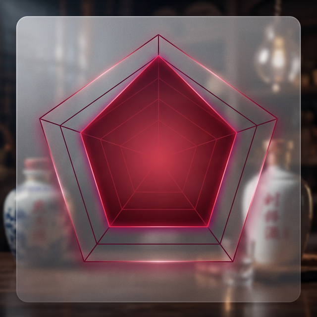

## 二、核心资产分析与 RWA 适配度评估

### 2.1 陆圣三类核心资产的 RWA 适配分析
 

 
| 资产类型 | 规模 | RWA 适配度 | 优先级 | 核心逻辑 |
|---------|------|-----------|--------|---------|
| **老酒库存（游樽）** | 3.7 万吨，内部测算约 200-280 亿区间（以第三方独立评估为准）¹ | ★★★★★ | **一期核心** | 实物稀缺、可量化、可托管、可赎回，自然增值无需主动运营 |
| **白酒生产收益权** | 1 万吨/年产能，崇州基地 | ★★★★ | **二期扩展** | 现金流可预测，类债券结构，适合稳健型投资者 |
| **微醺馆股权** | 各地开设，单店 300-800 万 | ★★★ | **三期延伸** | 股权 RWA 合规复杂度高，等生态成熟后推进 |

---

### 2.2 老酒资产为何是最优 RWA 标的

白酒老酒具备多数传统资产所不具备的 RWA 天然特性，是当前中国市场中**适配度最高**的 RWA 标的之一。

#### ① 自然增值：通缩资产模型，无需主动运营

老酒增值的核心驱动是**时间本身**，而非依赖主动经营。这在所有 RWA 标的中极为罕见：

- **品质提升**：白酒在陶坛中持续发生酯化反应，3年→5年→10年风味层次成倍跃升，质量提升带动价值上涨
- **量化损耗（天使之杯）**：每年自然挥发损耗约 2-3%，存量不可恢复，供给曲线刚性向下，价格底部有支撑
- **历史收益数据**：据北京歌德盈香拍卖行数据，2014-2024 年十年间，优质年份浓香原酒市场价格年均涨幅约 **12-18%**，显著跑赢通胀和主要股指
- **对比房地产 RWA**：房地产需要持续物业管理、税费支出、空置风险；老酒一旦入仓，托管成本极低（约为资产价值的 0.3-0.5%/年），且价值随时间自动增长

#### ② 高度标准化：代币化分割的天然基础

老酒资产的计量体系成熟，具备代币化所需的标准化基础：

| 维度 | 标准化程度 | 说明 |
|-----|-----------|------|
| 计量单位 | ★★★★★ | 以"吨"和"坛"（500L）为精确单位，无模糊空间 |
| 品质分级 | ★★★★ | 按香型（浓香/清香/兼香）、年份、执行标准分级，行业标准体系完整 |
| 价格发现 | ★★★★ | 公开拍卖市场（歌德盈香、典藏老酒）提供可参考的市场基准价 |
| 第三方检测 | ★★★★★ | 国家白酒质量检验中心可出具权威质量证书，作为链上元数据 |

**陆圣老酒分割方案**：

```
3.7 万吨老酒
  └─ 约 74,000 坛（每坛 500L）
       └─ 每坛铸造 1,000 份 NFT
            └─ 总计 7,400 万份可流通通证
                 ├─ 珍藏系列（10年+）：100元/份
                 ├─ 精选系列（5-10年）：50元/份
                 └─ 基础系列（3-5年）：20元/份
```

#### ③ 实物可托管：IoT + 链上存证，全链路可验证

区别于纯数字资产，陆圣老酒的实物性使"资产真实存在"可被持续验证：

- **物理层**：老酒存放于崇州恒温恒湿专业酒库，每坛 RFID 标签与链上 NFT ID 一一绑定
- **IoT 层**：仓库部署温度（18-25℃）、湿度（70-85%）、封存完整性传感器，数据每日自动上链存证
- **审计层**：每半年由德勤/毕马威等国际四大出具《实物资产核查报告》，上传至 IPFS，NFT 元数据中附加链接，持有人随时可验
- **保险层**：与中国人保或平安财险签订老酒库存专项财产险（含火灾、盗窃、自然灾害），保额覆盖评估价值的 110%

#### ④ 全球可比案例：酒类 RWA 已有成熟先例

陆圣老酒 RWA 并非无迹可寻，全球已有成功落地的酒类资产代币化项目：

| 项目 | 标的资产 | 规模 | 亮点 | 对陆圣的启示 |
|-----|---------|------|------|------------|
| **BlockBar** ([blockbar.com](https://blockbar.com)) | 威士忌/干邑单瓶 NFT | 已售出超 2000 万美元酒款 | 实物赎回机制成熟，与轩尼诗、格兰菲迪等顶奢品牌合作 | 单品稀缺性叙事可借鉴，但陆圣体量远超其规模 |
| **Vinovest** ([vinovest.co](https://www.vinovest.co)) | 全球精品葡萄酒组合 | AUM 超 1.5 亿美元 | 允许小额分散投资（500 美元起），AI 辅助选酒 | 低门槛普惠设计 + 资产组合化思路适合陆圣多年份 NFT 系列 |
| **RealT** ([realt.co](https://realt.co)) | 美国住宅房产代币化 | 累计代币化资产超 1 亿美元 | 每周自动将租金收入分红至持有人钱包地址 | 自动链上分红机制可直接移植至陆圣产能收益分配 |
| **Ondo Finance** ([ondo.finance](https://ondo.finance)) | 代币化美国国债/货币基金 | TVL 超 5 亿美元（2024年） | 机构级合规架构，与 BlackRock、摩根大通合作 | 顶级合规架构参考，展示 RWA 如何获得主流金融机构背书 |

> **核心结论**：全球酒类 RWA 市场已验证可行，但**中国白酒至今无一成功 RWA 案例**。陆圣有机会以 3.7 万吨老酒为底层资产，打造**体量最大、文化叙事最强**的酒类 RWA 项目，占据赛道制高点。

---

### 2.3 老酒资产价值评估方法论

为保障 RWA 发行的定价可信度，建议采用**三重估值法**相互验证：

**方法一：市场对比法（Market Comparable）**
- 参照北京歌德盈香、典藏老酒等平台成交数据
- 以同等香型、年份、品质的原酒批发市场价为基准
- 陆圣浓香原酒当前市场参考价：3-5年约 1500-2000 元/吨，5-10年约 3000-5000 元/吨，10年以上约 8000-15000 元/吨
- **注意**：上述为原酒批发市场价（大宗散酒，无品牌、无包装、无合规认证）。NFT 发行定价是**品牌化、代币化商品**定价，不可与原酒批发价直接对比——差异来源详见第四章 4.2 节"NFT 溢价构成分析"

**方法二：成本重置法（Cost Replacement）**
- 以当前新酒生产成本（粮食+能源+人工+设备折旧）加上陈化年份溢价计算
- 崇州基地当前新酒综合生产成本约 600-900 元/吨
- 加上多年陈化期间的资金成本（年化 6-8%）得出重置成本

**方法三：收益折现法（DCF）**
- 基于老酒历史年化增值率（12-18%）和预计持有期（5-10年）
- 折算当前公允价值区间，为 NFT 定价提供上限参考

> **建议**：一期发行前委托德勤/毕马威出具独立评估报告，采用上述三法均值作为 NFT 发行定价依据，同时向投资者披露完整评估过程。NFT 发行定价以此独立评估结论为准，**不以任何内部口径数字为定价基础**，这是保障投资者信任的关键。
>
> ¹ *"200-280 亿区间"为当前内部测算，基于三重估值法初步计算，最终权威数字以一期发行前的第三方独立评估报告（德勤/毕马威）为准。*

---

### 2.4 竞争壁垒分析：为什么陆圣能做、别人难以复制

| 壁垒维度 | 陆圣优势 | 竞争对手难度 |
|---------|---------|------------|
| **资产规模** | 3.7 万吨老酒，单一主体存量全国前列 | 大多数中小酒企无法在短期内积累同等规模的老酒库存 |
| **产地资质** | 崇州·档泉镇·天府粮仓核心区，政府重点扶持 | 核心产区资质稀缺，新进入者无法复制地理资源 |
| **文化 IP** | 陆游诗酒文化 800 年传承，具备独特的故事性和情感价值 | 文化 IP 需要长期积累，无法短期模仿 |
| **招商网络** | 游樽合伙人体系已建立，拥有覆盖全国的高净值投资者网络 | RWA 发行需要有效的初始社区，陆圣已有现成基础 |
| **先发优势** | 中国白酒 RWA 领域目前无成功案例，窗口期约 12-24 个月 | 一旦陆圣建立标准，后来者将面临更高的合规和信任成本 |

---
