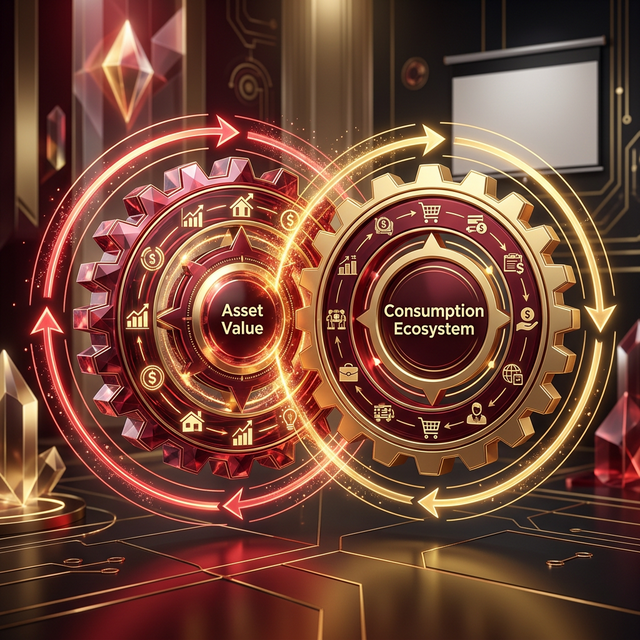

## 四、代币经济学设计

### 4.1 三币协同生态总图

醴链通证 RWA 的代币体系不是三个孤立的产品，而是围绕"老酒资产"这一核心，构成一个**相互锁定、互相赋能**的三层价值网络：

| 代币 | 层级定位 | 底层价值 | 发行阶段 | 对生态的驱动 |
|-----|---------|---------|---------|------------|
| **LS-WINE NFT** | 资产层（根基） | 老酒实物所有权 | 一期核心 | 实物赎回激活微醺馆消费场景 |
| **LSYIELD Token** | 收益层（血液） | 生产基地分红权 | 二期扩展 | 分红收益引导持有者再投入 NFT |
| **LS DAO** | 治理层（大脑） | 品牌共建决策权 | 三期生态 | 持有量决定投票权重，DAO 决策影响微醺馆扩张策略 |

> 三币共同驱动 **微醺馆消费生态**（线下场景锚点）——两层飞轮相互咬合，形成自我增强的正反馈循环。

**三币关系的逻辑**：LS-WINE NFT 是价值的**根基**（实物锚定），LSYIELD 是价值的**血液**（现金流分配），LS DAO 是价值的**大脑**（长期方向决策）。三者缺一不可，互相依存。

---

### 4.2 LS-WINE NFT：老酒资产权益 NFT（一期核心）

#### 基础参数

| 要素 | 设计 | 设计逻辑 |
|-----|------|---------|
| **代币标准** | ERC-1155（半同质化） | 同一批次内 token 同质可互换，不同批次/年份之间保持独立性，兼顾流动性和稀缺性 |
| **发行规模（一期）** | 3,700 吨（总量 10%），7,400 坛 × 1,000 份 = **7,400 万份** | 仅代币化 10% 库存，保持足够稀缺性，后续批次作为增量吸引力 |
| **一级发行总额** | 约 2.59 亿元人民币 | 按老酒当前市场均价计算，预留 20% 品牌溢价空间 |
| **赎回机制** | 持有 ≥ 1,000 份同批次 NFT（即 1 坛）可申请实物提取 | 保障 NFT 的实物价值底，同时触发销毁减少供给 |
| **年持有收益** | 年化估值增长（陈化溢价）+ 品牌溢价 | 老酒历史年化增值 12-18%，NFT 价格随之上涨 |

#### 三档发行系列（分层覆盖不同投资者）

| 系列 | 标的酒款 | 入库年份 | 发行单价 | 发行份数 | 对应资产量 | 目标投资者 |
|-----|---------|---------|---------|---------|-----------|----------|
| **珍藏系列** | 10年以上浓香调味酒 | 2015年前 | **100 元/份** | 500 万份 | 500 吨 | 高净值收藏投资者 |
| **精选系列** | 5-10年浓香基酒 | 2015-2020 | **50 元/份** | 2,000 万份 | 1,000 吨 | 中产稳健型投资者 |
| **基础系列** | 3-5年浓香/清香原酒 | 2020-2022 | **20 元/份** | 4,900 万份 | 2,200 吨 | 普惠型散户/白酒爱好者 |

> **策略说明**：珍藏系列制造稀缺感和媒体话题，精选系列承担主力募资，基础系列扩大持有人基数、建立社区规模——三档同时上线，覆盖从 20 元到数万元的全谱投资者。

#### NFT 溢价构成分析（以基础系列为例）

原酒批发市场价与 NFT 发行价之间存在合理且可量化的溢价结构，这是品牌化商品与大宗散酒的本质差异，并非定价虚高：

| 溢价构成 | 内容说明 | 对 NFT 价值的贡献 |
|---------|---------|----------------|
| **① 原酒底层成本** | 3-5年浓香原酒批发价 1,500-2,000 元/吨；1 坛 ≈ 450kg，原料成本约 675-900 元/坛 | 价值锚点基础，约占 NFT 总价值的 30-40% |
| **② 品牌 IP 溢价** | 陆游诗酒文化 800 年传承 + 游樽高端定位背书；参考茅台、泸州老窖等品牌酒与原酒的历史价差（通常 5-20 倍） | 品牌附加值，约占 15-20% |
| **③ 流动性与分割化溢价** | 传统原酒需整坛交易，1 坛动辄数千至数万元；NFT 拆分至 1,000 份，每份从 20 元起——显著降低准入门槛，本身即为可定价的流动性服务 | 金融工程溢价，约占 10-15% |
| **④ 赎回期权溢价** | 持有人随时可按协议价申请实物提酒，相当于内嵌一个美式看涨期权 | 期权价值，约占 10-15% |
| **⑤ 数字稀缺性溢价** | 链上总量封顶，每次赎回销毁对应 NFT，供给只减不增；类比有限版艺术品 | 稀缺性溢价，约占 10-15% |
| **⑥ 合规与托管成本** | 香港 STO 合规架构、独立第三方托管、智能合约审计、IPFS 存证——这些成本由发行方承担并转化为投资者的信任保障 | 信任溢价，约占 5-10% |

> **结论**：基础系列 20 元/份 × 1,000 份 = 2 万元/坛，对应 450kg 原酒的综合定价为约 44,000 元/吨。与批发散酒均价 1,750 元/吨相比，溢价约 25 倍——这与茅台系列品牌酒相对原料价格的溢价区间（20-50 倍）高度吻合，属于行业正常范围。**NFT 的定价本质是购买一个品牌化、合规化、链上可流通、随时可赎回的"数字酒权"，而非购买大宗散酒原料。**

#### 持有者专属权益（超越纯金融回报的"非卖品"价值）

- **品鉴特权**：持有基础系列 ≥ 500 份，可预约陆圣崇州基地"创始人品鉴日"
- **定制权**：持有珍藏系列 ≥ 1 坛，可委托陆圣酿酒师为其定制专属年份酒标
- **微醺馆席位**：持有任意系列 NFT 的用户，在微醺馆消费享受 8 折和优先包场权
- **新品优先权**：每次新批次 NFT 发行，现有持有者享受 72 小时白名单优先认购

---

### 4.3 LSYIELD Token：生产收益分红代币（二期）

崇州 1 万吨/年生产基地建成后，将产生稳定的年度净利润。LSYIELD 将这条现金流拆分成链上可流通的收益权，让投资者在持有老酒 NFT 之外，额外获得一条**类固定收益**的回报通道。

| 要素 | 设计 | 设计逻辑 |
|-----|------|---------|
| **代币标准** | ERC-20（同质化） | 收益权无需区分批次，完全同质，便于流通和 DeFi 集成 |
| **发行总量** | 10 亿枚，上限封顶不增发 | 总量固定防通胀，稀缺性随生态发展自然提升 |
| **释放机制** | 分 4 年线性释放（每年 25%），无团队预留 | 线性释放抑制早期砸盘，无团队份额防止利益冲突 |
| **分红来源** | 崇州基地年度审计后净利润的 **30%** | 剩余 70% 用于再投资（扩产/研发/新老酒收购） |
| **分红频率** | 按季度发放，自动分配至持仓钱包 | 参考 RealT 的周度分红机制，频率高增强粘性 |
| **锁仓加权** | 锁仓 ≥ 6 个月享受 1.2 倍加权分红 | 激励长期持有，减少短期抛压 |

**回报测算示例**（基于崇州基地投产后保守预测）：

| 场景 | 持有量 | 年度分红（预测） | 持有 5 年累计 |
|-----|-------|---------------|------------|
| 小额参与 | 1 万枚（约 5,000 元） | 约 250-500 元 | 约 1,250-2,500 元 |
| 中等参与 | 10 万枚（约 5 万元） | 约 2,500-5,000 元 | 约 1.25-2.5 万元 |
| 机构参与 | 1,000 万枚（约 500 万） | 约 25-50 万元 | 约 125-250 万元 |

> 注：上述测算基于崇州基地达产后年净利润约 1-2 亿元、LSYIELD 分配比例 30% 的保守假设，实际回报取决于基地运营效益。

---

### 4.4 LS DAO 治理代币（三期）

当 LS-WINE NFT 和 LSYIELD 形成足够规模的持有人社区后，引入 DAO 治理层，让"醴链通证"从一个金融产品演进为一个**持有者共建的品牌生态**。

**获取方式（非发售，而是赚取）**：

| 行为 | 获得 DAO 积分 |
|-----|------------|
| 持有 LS-WINE NFT 满 1 年 | 每坛每年 + 100 积分 |
| LSYIELD 锁仓 6 个月 | 每 1 万枚 + 50 积分 |
| 在微醺馆消费 | 每消费 1,000 元 + 10 积分 |
| 推荐新投资者成功认购 | 每人 + 200 积分 |

**积分到 DAO Token 的兑换**：每季度开放一次积分兑换，兑换后的 DAO Token 代表以下权力：
- 参与新批次 NFT 发行定价投票
- 参与微醺馆城市扩张策略投票
- 参与老酒资产收购方向投票
- 参与年度品牌代言人/联名对象投票

> **设计意图**：DAO Token 不能直接购买，只能通过"参与和贡献"积累，从根本上防止大资本操控治理，同时将最忠诚的用户转化为品牌的共建者。

---

### 4.5 经济飞轮：两个自我强化的增长循环



醴链通证 RWA 最核心的经济逻辑，是设计了**两个相互咬合的飞轮**，使生态在不需要外部持续输血的情况下，自我驱动增长：

**飞轮 A：老酒资产增值飞轮**

```
NFT 发行募资
    │
    ▼
陆圣扩大老酒收购和储备
    │
    ▼
老酒总库存增加 + 年份持续增长
    │
    ▼
稀缺性上升（赎回销毁 + 自然挥发减少供应）
    │
    ▼
NFT 二级市场价格上涨
    │
    ▼
吸引更多投资者入场 ──────────────────────► 回到起点
```

**飞轮 B：消费场景激活飞轮**

```
LSYIELD 分红发放
    │
    ▼
持有者收益增加，部分再投入购买 NFT
    │
    ▼
NFT 需求增加，价格支撑增强
    │
    ▼
品牌影响力扩大，更多用户认知醴链通证
    │
    ▼
微醺馆 NFT 持有者消费激活，线下场景繁荣
    │
    ▼
崇州基地销售收入增长 → 净利润提升
    │
    ▼
LSYIELD 分红总额增加 ───────────────────► 回到起点
```

**两个飞轮的咬合点**：微醺馆既是飞轮 A 的消费场景出口（NFT 持有者到店权益），又是飞轮 B 的收入来源（拉动基地销售）。这意味着：**线下实体越繁荣，两个链上飞轮转得越快**——这是本项目相较于纯链上 RWA 项目的核心竞争优势。

---

### 4.6 价值防御机制：四道护城河

即使市场出现系统性下行，以下四道机制保障代币价值不崩溃：

| 防线 | 机制 | 效果 |
|-----|------|------|
| **第一道：实物价值底** | 每份 NFT 背后有真实老酒，最坏情况可实物赎回 | NFT 价格不可能低于对应老酒实物市场价 |
| **第二道：稀缺性加速** | 实物赎回导致 NFT 销毁，市场恐慌期反而加速供给收缩 | 恐慌性赎回会减少流通量，反向支撑剩余 NFT 价格 |
| **第三道：持续回购** | 陆圣集团承诺以年营收的 3-5% 在二级市场持续回购 NFT | 市场抛压有稳定接盘方，防止踩踏 |
| **第四道：超额储备** | SPV 持有老酒资产始终维持已发行 NFT 对应价值的 120% | 提供价格缓冲垫，即使市场波动也有充足保障空间 |

---

### 4.7 发行时间表与代币供应节奏

```
2026 Q4（一期）
  └─ LS-WINE NFT 珍藏 + 精选系列上线（专业投资者限定）
       └─ 发行额度：约 1.5 亿元

2027 Q1-Q2（一期扩展）
  └─ LS-WINE NFT 基础系列向散户开放
       └─ 发行额度：约 1 亿元

2027 Q3（二期）
  └─ LSYIELD Token 首批释放（崇州基地投产后）
       └─ 首年释放 25%，约 2.5 亿枚

2028 Q1（三期）
  └─ LS DAO 积分系统上线，治理代币首次兑换开放
       └─ 覆盖社区规模目标：≥ 5 万名持有人
```

> **核心原则**：每一步扩张都以前一步的社区健康度为前提，宁可慢推，不可为了融资节奏透支信任。

---
