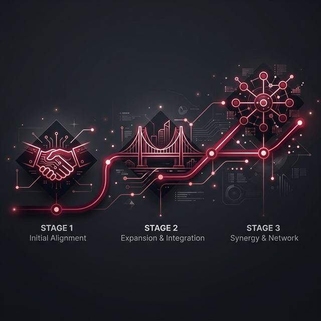

## 五、与现有游樽招商体系的融合设计

> **核心命题**：醴链通证 RWA 不是来颠覆游樽合伙人体系的，而是来帮它"进化"的。现有合伙人是最天然的创世用户，他们的信任和网络是 RWA 生态冷启动最宝贵的资产。

---

### 5.1 现有体系的三大结构性痛点

游樽合伙人体系在招商可行性上具有相当竞争力，但存在三个根本性局限，单靠运营优化无法解决，只有通过 RWA 底层架构才能真正破解：

**痛点一：资产可信度的"玻璃天花板"**

3.7 万吨老酒、内部测算逾 200 亿的品牌价值——这些数字目前只能以文字和内部报告的形式呈现给投资者（内部口径未经独立审计，尚不具备公开发行级别的公信力）。无论陆圣如何强调，在没有独立可验证机制的情况下，投资者的信任始终建立在"相信对方不会说谎"之上，而非建立在可查实的事实之上。这是高净值投资者决策的最大心理障碍，也是现有方案在超过 1000 万元档位时招募难度急剧上升的根本原因。

**痛点二：流动性困局——进得来、出不去**

现有退出机制依赖总部回购，最高年化仅 10%。对于一个投入了 300 万-1000 万元的合伙人而言，这意味着：
- 退出周期不可控（总部资金状况决定回购节奏）
- 退出价格无市场化锚点（由总部单方定价）
- 无法将合伙权益作为资产质押融资
- 合伙人之间无法自由转让（缺乏标准化载体）

**痛点三：市场边界的"围墙"——只能向内**

现有合伙人招募完全依赖国内线下人脉网络：KOL、行业展会、私下转介绍。全球 6000 万海外华人、香港/新加坡高净值华人社群、对中国文化资产有强烈兴趣的外籍投资者——这些庞大的潜在市场，在现有框架下完全无法触达，因为没有合规的全球化发行通道。

---

### 5.2 精准映射：RWA 如何逐一破解三大痛点

| 痛点 | 现有方案的局限 | RWA 解法 | 改变的本质 |
|-----|-------------|---------|----------|
| **资产可信度** | 文字描述 + 内部报告，投资者无法独立验证 | 德勤审计上链 + IoT 实时数据 + IPFS 不可篡改存证，任何人任何时间可自行核查 | 从"信任人"升级为"信任数学" |
| **退出流动性** | 单向总部回购，价格和时间由总部掌控 | 合规二级市场自由交易，市场化定价，随时可买卖 | 从"单行道"升级为"高速公路" |
| **市场覆盖** | 只能面向国内线下人脉圈层 | 香港 STO 合规发行，全球华人市场可参与，未来可接入国际 DeFi 生态 | 从"一个房间"升级为"全球舞台" |

---

### 5.3 游樽合伙人的"创世者"特权：先入者的不对称优势

对于现有游樽合伙人，参与 RWA 创世发行不只是"多一个选择"，而是获得一批**后来者永远无法复制**的创始权益：

**① 折扣认购权（价格优势）**
- 所有现有游樽合伙人，在 LS-WINE NFT 一级发行时享受 **85 折**优先认购权
- 白名单资格锁定 72 小时，期内份额保留，不受公开发行竞争影响
- 投资档位越高，折扣越深（1000 万以上档位享受 80 折）

**② 创世者徽章 NFT（身份优势）**
- 参与一期发行的合伙人将额外获赠一枚不可交易的"醴链创世者"徽章 NFT
- 该徽章赋予永久有效的持有人专属权益：微醺馆终身 VIP / 每年品鉴活动优先席位 / DAO 提案加权
- 徽章数量等于一期实际参与合伙人数，此后永远不再增发——**稀缺性由历史时刻决定**

**③ 资产互认权（资产升维）**
- 持有游樽合伙协议的投资者，可将其合伙权益评估后**按比例转换为 LS-WINE NFT**，无需追加新资金
- 转换后原合伙协议终止，NFT 持有人享有链上资产权益 + 二级市场流动性 + 全球可流通
- 这相当于将现有"锁死的资产"一键解锁为"流动资产"，对存量合伙人具有极强吸引力

**④ 微醺馆股东优先权（场景优势）**
- 持有 LS-WINE NFT 珍藏系列 ≥ 5 坛的现有合伙人，在所在城市新开微醺馆时享有**优先股东席位锁定权**
- 即：RWA 资产的持有量直接影响线下经营权的获取，形成"链上资产→线下权益"的完整转化

---

### 5.4 双轨并行的三阶段融合路线图
 

 
**不是替代，而是进化**——游樽合伙人体系和醴链通证 RWA 将在三个阶段中逐步融合为一个更强大的整体：

**第一阶段（0-6个月）：平行启动，建立信任**

| 轨道 | 状态 | 关键动作 |
|-----|------|---------|
| 游樽合伙人体系 | 正常运营，不变 | 向存量合伙人介绍 RWA 概念，获得白名单资格 |
| 醴链通证 RWA | 独立启动 | 完成老酒独立审计 + 香港 SPV 注册 |

两轨关系：游樽合伙人获得一期白名单优先认购资格，提前了解 RWA 体系。

---

**第二阶段（6-18个月）：权益互通，生态共振**

| 游樽现有权益 | 升级路径 |
|-----------|---------|
| 分红权 | 可选择转化为 LSYIELD Token（链上化） |
| 老酒凭证 | 可选择对应铸造 LS-WINE NFT（资产化） |
| 微醺馆股东席位 | NFT 持有量成为获取资格的新标准 |

两轨关系：部分合伙人完成资产迁移，RWA 以游樽社区为基础完成冷启动。

---

**第三阶段（18个月+）：完全融合，统一生态**

游樽合伙人体系与醴链通证 RWA 完成底层打通：
- 所有新增合伙权益默认以 NFT 形式发行
- 微醺馆运营数据实时上链，股东分红自动执行
- DAO 治理覆盖游樽品牌重大决策

**最终形态**：一个有实物资产支撑、有链上流动性、有全球受众的统一生态。

---

### 5.5 存量合伙人的完整转化路径

以一位典型的"300 万-1000 万档位"游樽合伙人为例，展示 RWA 如何具体改变其投资体验：

**现状**：投入 500 万，持有游樽合伙协议，享有分红权 + 区域代理权 + 微醺馆开设权。退出只能靠总部年化 8% 回购。

**RWA 升级后**：

| 维度 | 升级前 | 升级后 |
|-----|--------|--------|
| 资产形态 | 纸质合伙协议 | LS-WINE NFT（链上资产） |
| 资产透明度 | 相信总部报告 | 链上实时可查，独立验证 |
| 退出方式 | 只能总部回购，等待 30 个工作日 | 随时在合规平台挂单出售，T+1 结算 |
| 分红方式 | 按会计年度，人工结算 | LSYIELD 自动按季发放至钱包 |
| 资产可抵押性 | 无 | NFT 可在 DeFi 协议中质押借贷 |
| 全球流通 | 无 | 全球华人投资者可接盘，市场深度大幅提升 |
| 附加权益 | 区域代理权（本地有效） | 创世者徽章 + 微醺馆优先股东权（全国有效） |

---
