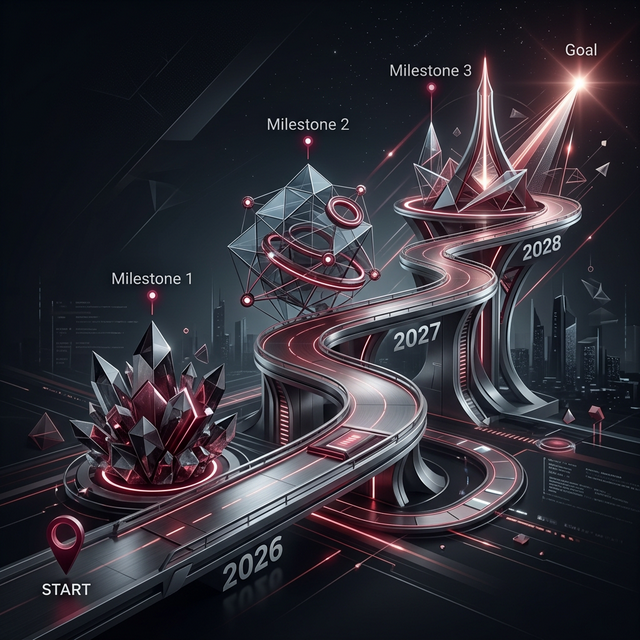

## 十一、立即行动建议与执行路线图

> **核心原则**：每一个阶段的推进都必须以上一阶段的关键成果为前提。宁可慢三个月，不可在基础不牢固时强行推进——一旦信任崩塌，重建的成本是无限的。

---

### 11.1 三年执行路线图（甘特式）




```
                    2026               |         2027          |      2028
              Q2    Q3    Q4    Q1    Q2    Q3    Q4    Q1    Q2
─────────────────────────────────────────────────────────────────────────
【法律与合规】
香港公司注册       ████
法律意见书         ████
SPV架构搭建              ████
白皮书撰写               ████
SFC备案                        ████
散户资质申请                                           ████ ████
新加坡MAS申请                                                      ████

【资产与技术】
老酒实物审计       ████ ████
IoT仓库改造              ████ ████
智能合约开发             ████ ████
CertiK审计                           ████
App开发                        ████ ████
上线测试网                                  ████
正式主网上线                                     ████

【发行与运营】
创世者招募                       ████
白名单认购                             ████
一期珍藏/精选公开发行                        ████
二级市场开放                                  ████
基础系列散户发行                                    ████ ████
LSYIELD发行                                              ████
DAO上线                                                        ████ ████

【营销与社区】
种子KOL邀请              ████
创始者品鉴会                   ████
媒体白皮书发布                       ████
崇州KOL探访活动                           ████
全球华人社区运营                                ████ ████ ████ ████ ████
CoinDesk专题合作                                    ████
─────────────────────────────────────────────────────────────────────────
```

---

### 11.2 团队建设：关键岗位与招募节奏

醴链通证是一个横跨酒业运营、金融合规、Web3 技术、品牌营销四个领域的复杂项目。当前陆圣团队的白酒运营能力是核心优势，需要补充的是其他三个领域的专业人才：

**必须在 2026 Q2 前到位（P0 岗位）**：

| 岗位 | 职责 | 理想背景 |
|-----|------|---------|
| **RWA 项目总监** | 统筹整个 RWA 项目推进，对接法律/技术/商务各方 | 曾主导过 RWA 或 STO 发行项目；有金融 + Web3 双背景 |
| **香港合规负责人** | 主导 SFC 合规流程，管理持牌平台关系，监控监管动态 | 曾在 SFC 持牌机构或律所工作，熟悉香港虚拟资产法规 |
| **智能合约首席工程师** | 负责合约开发、安全审计对接、链上运营 | Solidity 3 年以上经验，有 RWA/DeFi 项目经验 |

**2026 Q3-Q4 前到位（P1 岗位）**：

| 岗位 | 职责 | 理想背景 |
|-----|------|---------|
| **社区运营总监** | Discord/微信/Twitter 多平台社区建设，KOL 关系管理 | 主导过 Web3 项目社区冷启动，中英双语 |
| **品牌创意总监** | NFT 视觉设计、文化 IP 叙事内容制作 | 有数字艺术 + 传统文化品牌双背景，理解 Web3 美学 |
| **机构业务总监** | 对接私行、加密基金等机构投资者，推动大额认购 | 私人银行或机构销售背景，有香港金融圈人脉 |

---

### 11.3 预算分配（三年总投入估算）

| 预算类目 | 2026 | 2027 | 2028 | 三年合计 | 占比 |
|---------|------|------|------|---------|------|
| 法律与合规（律所、SFC备案、合规咨询） | 600 万 | 300 万 | 200 万 | **1,100 万** | 11% |
| 审计与资产评估（四大、质检机构） | 400 万 | 300 万 | 300 万 | **1,000 万** | 10% |
| 技术开发（合约开发、App、安全审计） | 800 万 | 500 万 | 300 万 | **1,600 万** | 16% |
| 仓储改造（IoT、RFID、智能化升级） | 700 万 | 200 万 | 100 万 | **1,000 万** | 10% |
| 团队薪酬（6+人核心团队） | 600 万 | 1,200 万 | 1,500 万 | **3,300 万** | 33% |
| 市场营销（KOL、活动、媒体、广告） | 400 万 | 800 万 | 600 万 | **1,800 万** | 18% |
| 应急储备（10%） | 350 万 | 350 万 | 300 万 | **1,000 万** | 10% |
| **合计** | **3,850 万** | **3,650 万** | **3,300 万** | **约 1 亿元** | 100% |

> **资金来源**：一期 NFT 发行募资约 2.59 亿元，扣除项目前期成本约 1 亿元后，净融资约 1.59 亿元注入陆圣运营体系（含崇州基地扩建）。前期 1 亿元项目启动资金由陆圣集团现有资金/股东注资解决。

---

### 11.4 阶段关口（Go/No-Go 判断标准）

每个关键节点设置明确的通过标准，确保"不达标不进入下一阶段"：

| 关口 | 时间 | 通过条件 | 不通过则 |
|-----|------|---------|---------|
| **关口 1：资产确权** | 2026 Q3 末 | 德勤完成实物盘点报告；法律意见书确认 STO 可行；SPV 注册完成 | 延期推进，排除障碍后重新评估 |
| **关口 2：技术就绪** | 2026 Q4 初 | 合约通过 CertiK 审计无高危漏洞；App 测试版完成；持牌平台合作协议签署 | 延迟发行，不可带漏洞上线 |
| **关口 3：一期验证** | 2027 Q1 末 | 一期发行募资≥5,000 万元；持有人≥200 人；无重大合规投诉 | 暂停二期，优先维护和改善一期生态 |
| **关口 4：生态成熟** | 2027 Q3 末 | 二级市场月均交易额≥3,000 万元；持有人≥3,000 人；社区 NPS≥60 | 延迟 LSYIELD 发行，先解决流动性问题 |
| **关口 5：全面开放** | 2028 Q1 | SFC 散户资质批准；DAO 治理系统测试完成；法律团队确认合规 | 维持专业投资者模式运营，等待资质 |

---

### 11.5 当下三个月的 P0 任务清单

停止规划，立即行动。以下是未来 90 天最关键的三件事：

**第一件（本月内启动）：启动老酒独立审计**
- 联系德勤香港或毕马威，签订实物盘点与价值评估协议
- 提供仓库访问权限和历史入库记录
- 明确报告完成时间节点（目标：2026 Q3 出具正式报告）
- **为什么这是第一优先级**：一切后续工作——NFT 定价、法律架构、白皮书——都依赖这份独立审计报告。没有它，后面的事情都是空中楼阁。

**第二件（本月内接触）：与香港律所和持牌平台建立关系**
- 联系方达律师事务所香港办公室，安排初步磋商
- 通过行业介绍人接触 HashKey 或 OSL 的业务负责人，了解合作条件
- **为什么现在做**：律所和平台的档期紧张，越早建立关系越能争取到优质服务资源

**第三件（本月内招募）：找到 RWA 项目总监**
- 在 LinkedIn、Web3 猎头渠道发布需求，圈定 10 名候选人
- 优先考虑有 STO 发行实战经验的候选人（哪怕没有中国白酒背景）
- **为什么这件事不能等**：没有专职的 RWA 项目总监，现有陆圣团队无法有效推进上述两件事，所有工作都会分散。

---

**最后：一个清醒的认知**

醴链通证 RWA 是一个需要 3 年才能真正验证价值的项目。它不是快速融资的工具，不是炒热度的噱头，而是一次对陆圣集团未来十年战略方向的深刻押注。

成功的条件只有一个：**把老酒资产的真实价值，用世界上最透明的方式，呈现给全球最聪明的投资者**。

做到这一点，醴链通证不只是中国白酒行业的第一个 RWA——它将成为整个行业的基础设施标准。

---

## 附录：关键参考案例

### 案例 1：BlockBar（威士忌/白兰地 NFT 平台）
- **模式**：将稀缺威士忌/白兰地酒瓶代币化，NFT 持有者可在平台存储实物，也可二级交易
- **规模**：已销售超 2,000 万美元的酒款 NFT
- **对陆圣的启示**：陆圣拥有 3.7 万吨老酒，资产规模远超 BlockBar，且白酒文化 IP 更深厚

### 案例 2：RWA.xyz / Ondo Finance（美国国债 RWA）
- **模式**：将美国国债代币化，全球投资者可通过持有 Token 获得国债收益
- **规模**：2024 年 RWA.xyz 追踪的代币化国债规模超 300 亿美元
- **对陆圣的启示**：稳定现金流资产（陆圣产能收益）同样适合此模式

### 案例 3：香港 AssetLink（酒类 RWA 平台）
- **模式**：在香港合规框架下将葡萄酒资产代币化，面向亚洲高净值人群
- **融资**：2024 年完成 5000 万港元 A 轮融资
- **对陆圣的启示**：香港监管框架已成熟，葡萄酒 RWA 可行，白酒同样可行且更有本土优势

---

*本规划文件为战略框架，具体条款和参数需在法律、财务专业顾问协助下进一步细化。*
